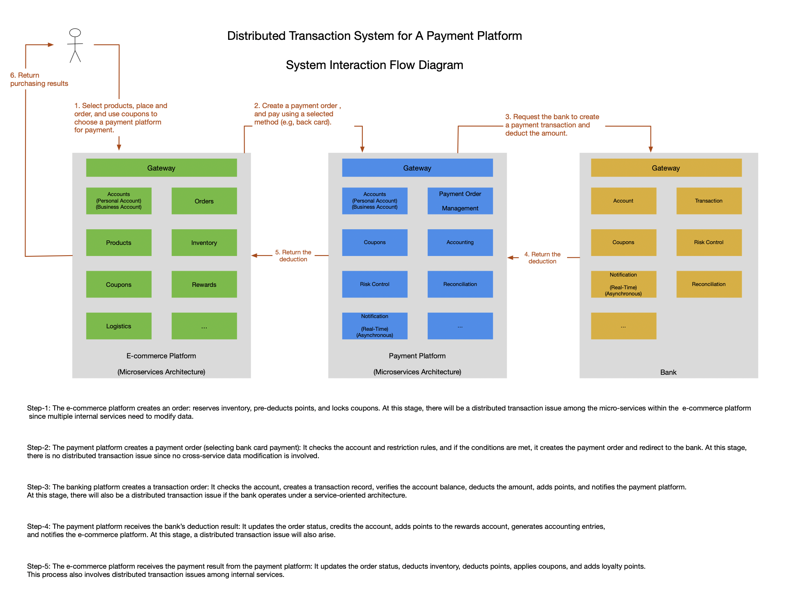
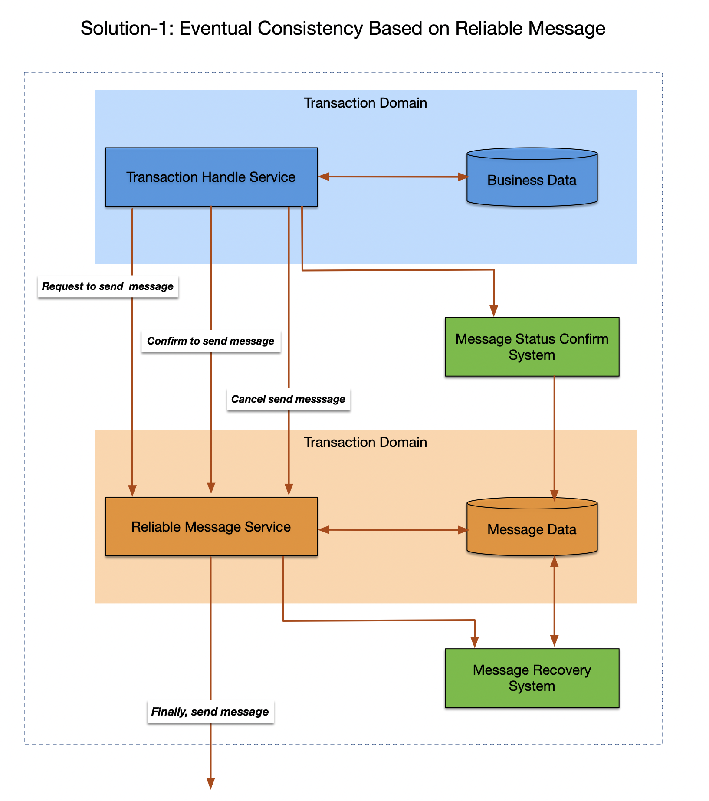
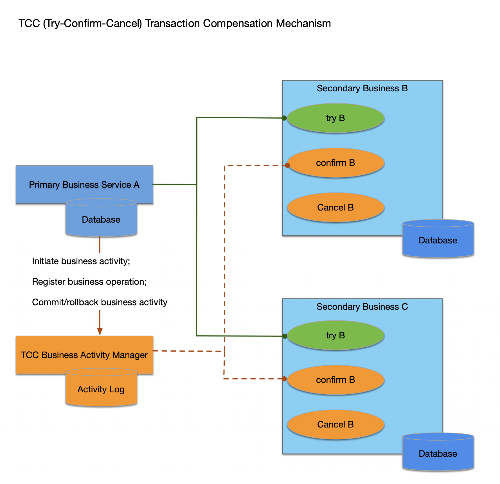
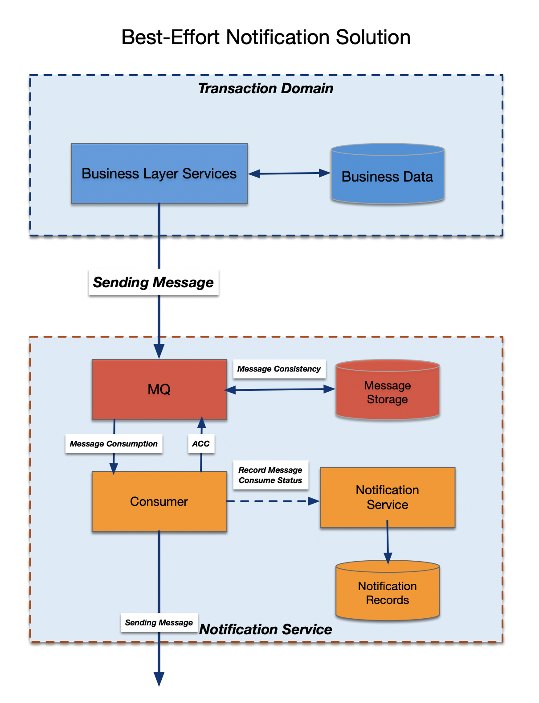

# Spring-Microservices-TX

## 🔗 Introduction 
### Practical Case Studies & Best Practices
This repository focuses on distributed transaction solutions, using real-world payment systems and payment order processing as case studies. We explore classic scenarios to introduce different approaches for solving distributed transaction challenges. The repository provides detailed design implementations using Spring Boot, explaining the trade-offs made and how various techniques are leveraged to achieve best practices in distributed transaction management.

In this repository, we implement three classic scenarios for tackling distributed transaction problems:

- Eventual Consistency-Based Reliable Messages
- TCC (Try-Confirm/Cancel)
- Best-Effort Notification

### Broad Applicability Across Microservices
- While the implementations in this repository are built with Spring Boot, the core concepts, patterns, and solutions apply to any microservices-based architecture. These approaches are not limited to Java—they can be adapted to any technology stack that follows the microservices architecture. Whether you’re using Go, Node.js, or Python, these strategies remain applicable and effective for ensuring data consistency in distributed systems.

---

## 🌟System Architecture Diagram

--- 

## 📚 Common Solutions for Data Consistency in Distributed Transactions

### Eventual Consistency Based on Reliable Messages

### TCC(Try-Confirm-Cancel) Transaction Compensation Mechanism

### Best Effort Notification

---

## 📩 Use Scenarios 

This repository is designed for **enterprise-level distributed transactions** in critical financial domains, including: 
- 🛒 **E-commerce internal payment systems** - Ensuring reliable order payments, refunds, and transaction consistency.
- 🏦 **Financial and banking systems** - Hndling secure fund transfers, settlements, and transactions integrity across multiple services. 

---

## 🌟 Key Features
- **Reliable Messaging**: Ensures the consistency of messages across distributed services.
- **Spring Boot 3.0**: Simplifies microservice development and configuration.
- **RabbitMQ**: Uses RabbitMQ as the mssaging queue to handle communication between services.
- **Distributed Tarnsaction Solutions**
- **Reliable Mesage Final Conistency**: Ensures eventual consistency in distributed transactions.
- **TCC(Try-Confirm/Cancel)**: Implements a robust two-phase commit transaction model.
- **Maximum Effort Notification**: A flexible approach for guaranteening message delivery.

---

## 🚀 Technology Stack

- **Spring Boot 3.0**: Fast, flexible microservice framework for Java applications.
- **RabbitMQ**: Message broker that enables communication between services in a distributed architecture. It helps decouple services, ensuring reliable message delivery and eventual consistency in distributed transactions.
- **Spring MVC**: Framework for developing RESTful APIs.
- **MySQL**: Relational database management for storing transaction data.
- **Docker**: Containerization for easy deployment.
- **JDK 17**: Java Development Kit for building applications.

---

## 📚 Tutorial && References

This project is designed to help you implement **reliable messaging and distributed transaction** solutions in micoservices. 
It includes: 

- **Reliable Message Final Consistency**: Local and independent Message Service implementaitons. 
- **TCC Transactions Model**: Try-Confirm/Cancel approach. 
- **Maximum Effort Notification** Ensuring eventual consistency and retries. 

This sample project uses a **payment system** scenario and demostrates the following: 
- **Reliable Message Final Consitency**: A message is sent and confirmed with eventual consistency. 
- **TCC**: The implementation of **two-phase** commit in the distributed system. 
- **Maximum Effort Notification**: Handling retries and ensuring message delivery.

For a step-by-step guide on how these solutions work, check out the following tutorials: 
- [An In-Depth Analysis of Distributed Transaction Solutions](https://www.alibabacloud.com/blog/an-in-depth-analysis-of-distributed-transaction-solutions_597232)
- [How RocketMQ Helps Achieve Better Message Reliability](https://www.alibabacloud.com/blog/how-rocketmq-helps-achieve-better-message-reliability_597836)

---

## 📈 Use Cases

- **Distributed Payment Systems**: Ensure consistency in payments across multiple services; 
- **Order Management**: Handle distributed order creation, cancellation, and updates reliably. 
- **Event Driven Architecture**: Implement eventual consistency in microservices. 

---
## 🚩 Milestones
- [Milesteons](https://github.com/Rurutia1027/Spring-MQ-Reliable-TX/milestones)

---

## 📝 License
- [MIT LICENSE](./LICENSE)
