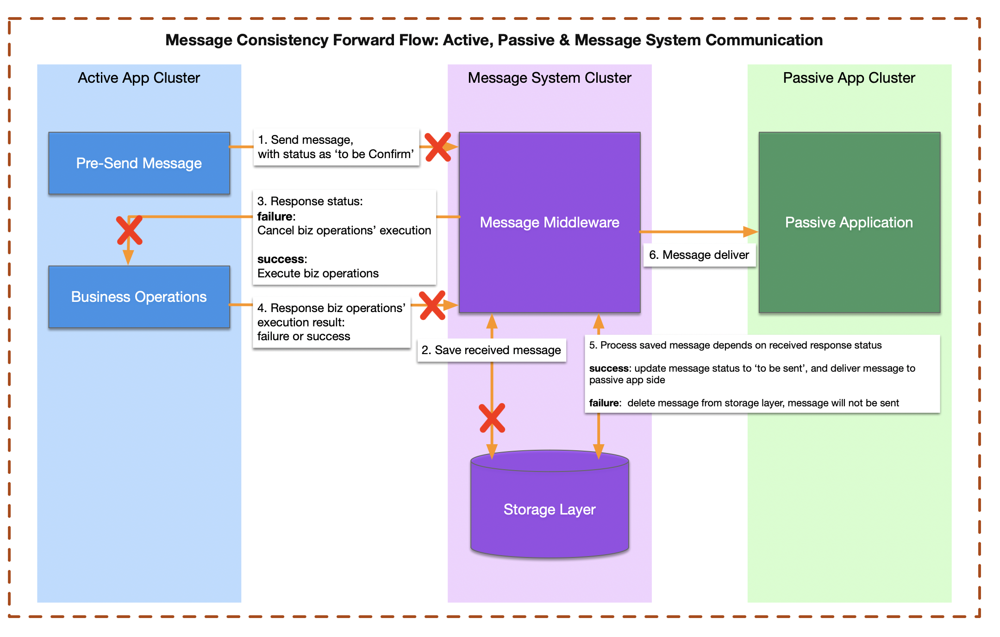

# Message Consistency Exception Flow -- Active Side Perspective 

## Possible Failures/Exceptions in Message Consistency from the Active Application's Perspective 

| Exception Description | Possible State & Causes | Consistency? |
|----------------------|----------------------|--------------|
| **Pre-send message failure** | The message was not written to the Message System's Storage Layer due to issues with the active application, network, message middleware, or message storage. | ✅ Consistent |
| **After pre-sending the message, the active application did not receive a storage result response from the message system.** | **Case 1:** The message hasn't persisted to the Message System's Storage Layer. | ✅ Consistent |
|  | **Case 2:** The message has been persisted to the Message System's Storage Layer with status ‘to be confirmed,’ but the response was not received. | ❌ Not Consistent |
| **Received a successful message storage response, but the active application encountered an exception before executing the business operation.** | The message was successfully written to the Message System’s Storage Layer and set to ‘to be confirmed,’ but the active application failed before executing the business logic. | ❌ Not Consistent |

---

## Possible Failures/Exceptions in Message Consistency from the Message System's Perspective 
| Exception Description | Possible State & Causes | Consistency? |
|----------------------|----------------------|--------------|
| **Message middleware did not receive the business operation result from the active application.** | **Case 1:** The message is stored as ‘to be confirmed,’ but the business operation was not executed or failed and rolled back. | ❌ Not Consistent |
|  | **Case 2:** The message is stored as ‘to be confirmed,’ and the business operation was successfully executed. | ❌ Not Consistent |
| **Message middleware received the business operation result (success/failure) but failed to update the message status in storage.** | **Case 1:** The message was written to storage with ‘to be confirmed’ status, but the business operation was not executed or rolled back due to an error. | ❌ Not Consistent |
|  | **Case 2:** The message was written to storage with ‘to be confirmed’ status, and the business operation was successfully executed. | ❌ Not Consistent |

---

# Exception Summary and Handling Methods

| Exception Scenario | Consistency? | Handling Method |
|-------------------|-------------|----------------|
| **1. The message was not written to the storage layer, and the business operation was not executed.** | ✅ Consistent | No action needed. |
| **2. The message was written to the storage layer (status: ‘to be confirmed’), but the business operation was not executed, preventing the message from being pushed to the message system.** | ❌ Not Consistent | The message system should verify the business operation result and handle the message (delete it). The active application should also maintain records of different business operation states (success/failure, execution status) and expose an API for the message system to query this status. |
| **3. The message was written to the storage layer (status: ‘to be confirmed’), and the business operation executed successfully, but the message failed to be pushed to the message system.** | ❌ Not Consistent | The message system should verify the business result, update the message status, and ensure its proper delivery to downstream passive applications. |

