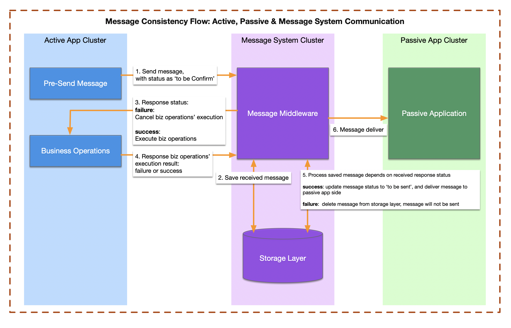

# Flexible Solution to Guarantee Message Consistency

## Step-1: Active Application Sends Message 
- The active application sends a message to the message middleware (broker).
- The message status is initially marked as "to be confirmed". 

## Step-2: Message System Stores Message Record 
- The message system receives the message and store it into the BOT storage layer. 
- No further action is required from the passive party at this point. 

## Step-3: Message System Response to Active Application 

- The message system responds to the active application with the status of the message. 

### Case 1: Failure Response 
- If the message system fails to store the message in the storage layer. 
  - The active application side receives a failure response. 
  - The active applicaiton side **cancels the business logic** and ends the process. 

### Case 2: Success Response 
- If the message system successfully stores the message:
  - The active application receives a success response. 
  - The active applicaiton proceeds with executing the business logic.

## Step-4: Business Logic Execution 
- The active application completes the business logic. 
- The results of the business logic are packaged as a message (either success or failure).
- The active application sends the result to the message middleware. 

## Step-5: Message Middleware Processes the Business Logic Result 
- The message middleware processes the result from the active application. 
### Case 1: Failure Response 
- If the business logic indicates a failure: 
  - The message middleware **deletes the stored message** from the storage layer. 
  - The process ends. 
### Case 2: Success Response 
- If the active side's applicaiton business logic is successful: 
  - The message middleware updates the message status from **"to be confirmed"** to **"to be delivered"**.
  - The middleware then proceeds to deliver the message to the passive party. 
## Step-6: Message Delivered to Passive Application 
- Once the message status is updated and the message is ready for delivery, the message is sent to the passive application. 
- The passive application receives the message. 