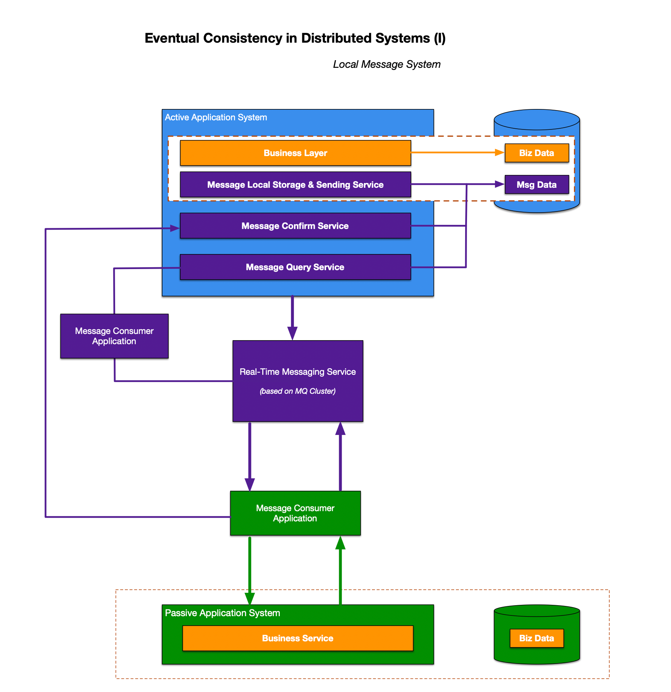

# Eventual Consistency in Distributed System (I)
__Local Message System__

In this article, we introduce the design of an eventual consistency messaging system, the interaction flow among different systems, and the possible failure points that lead to message inconsistency, along with corresponding solutions. Finally, we will discuss the trade-offs of this local message system-based design for achieving eventual consistency.

### Forward Flow - Steps Description

#### Active Party Application System
- The active party completes its business operation and, within the scope of the business transaction, calls the (local) message service.
- The message service first records a message record in the database of the Active App System (including message status, Unique ID, timestamp, etc.).
- The message is then pushed to the Real-Time Message Service (built based on MQ middleware cluster).

#### Real-Time Message Service
- Once the Real-Time Message Service receives the message from Active App side, it forwards it to the Message Queue (MQ) or topic.

#### Message Consumer Application
- The Message Consumer Application belongs to or is accessible by the Passive Party Application System, but it can be deployed:
  - Independently as a separate service.
  - Alongside the Passive App System.
- **Scaling Strategy:** The deployment model depends on the listener scale and message consumption traffic pressure.

- It listens to specific queues or topics in the Real-Time Message Service, retrieves messages, and delivers them to the Passive Party App System.
- It also synchronizes message status between the Passive App System and Active App System when required.

#### Passive Party Application System
- When receiving the message from the Message Consumer Application, the Passive App System:
  - Validates the message and confirms whether the Active Party has completed its business operation (e.g., bank deduction).
  - Triggers relevant business processes (e.g., order status updates, accounting).
  - Updates its business database and sends a response message back to the Message Consumer Application.

#### Final Acknowledgement
- The Message Consumer Application forwards the response message to the Active Party Application System.
- The Active App System retrieves the previously stored message using the Message UID and updates its status in the local database (including business data updates, message status updates, and timestamps).

### Message Recovery Scenario - Steps Description
- If a message fails to be processed successfully due to system failures or network issues, it may remain in a "pending" or "to be confirmed" state.
- The Message Recovery App periodically queries the Message Query Interface provided by the Active App side to retrieve failed message database records, and converts them into the Retry-Messages.
- Retry-Messages that have not exceeded their retry limit are re-sent to the Real-Time Message Service for another attempt at delivery.
- This mechanism helps recover messages that were lost or not successfully processed due to transient failures, ensuring eventual consistency.

---

## Advantages & Disadvantages of Local Message System Solution

### Advantages

- **High-Real-Time Responsiveness**: The system ensures low-latency message processing, making real-time interactions highly feasible.
- **Decoupled from Specific MQ Middleware**: The design achieves message availability and reliability without tightly coupling to a specific message queue (MQ) middleware.
- **Flexible Message Queue Selection**: Since the design minimizes reliance on MQ middleware features, developers can freely switch between different message queue implementations without being locked into a specific MQ provider's proprietary features.
- **Lightweight and Easy to Implement**: The architecture is simple, easy to integrate, and does not introduce heavy dependencies, making it a practical and efficient messaging solution.

### Disadvantages

- **Tight Coupling to Specific Business Context**: The local message system is tightly coupled with the specific business context, making it less flexible for future adjustments.
- **Messages and Business Data Stored in the Same Database**: Since message data and business data are stored in the same database, the system's performance may be impacted as the business environment grows more complex.
- **Message Services Incompatibility with Traditional RDBMS**: Many business systems use traditional RDBMS for storing data. However, RDBMS is not well-suited for message services (e.g., MQ middleware supports partitions by default) and may even cause bottlenecks, making the combination of business services and message systems less efficient.

---

## References

- Mastering Eventual Consistency Patterns in System Design: Real-World Insights from Power Grid Monitoring
- Eventual Consistency in Distributed Systems | Learn System Design